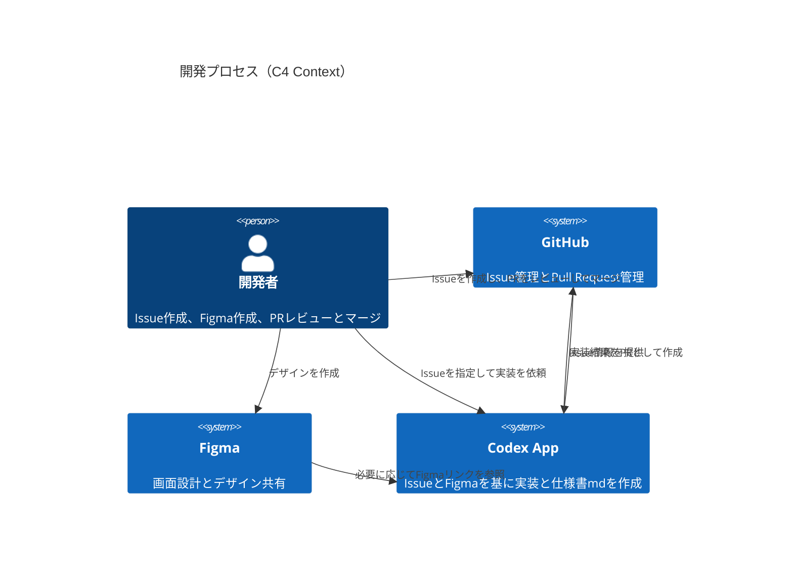

# NoZanLane

Offline Mac desktop task planner with relative point estimates and velocity tracking.

## 開発プロセス

このリポジトリは Codex を使ったバイブコーディングで開発を進めています。

```mermaid
C4Context
  title 開発プロセス（C4 Context）

  Person(dev, "開発者", "Issue作成、Figma作成、PRレビューとマージ")
  System(github, "GitHub", "Issue管理とPull Request管理")
  System(figma, "Figma", "画面設計とデザイン共有")
  System(codex, "Codex App", "IssueとFigmaを基に実装と仕様書mdを作成")

  Rel(dev, github, "Issueを作成し、PRをレビューしてマージ")
  Rel(dev, figma, "デザインを作成")
  Rel(dev, codex, "Issueを指定して実装を依頼")
  Rel(github, codex, "Issue情報を提供")
  Rel(figma, codex, "必要に応じてFigmaリンクを参照")
  Rel(codex, github, "実装結果をPRとして作成")
```
